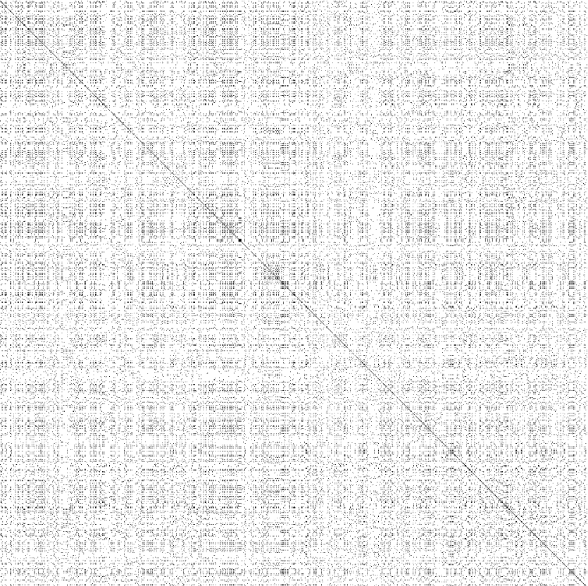
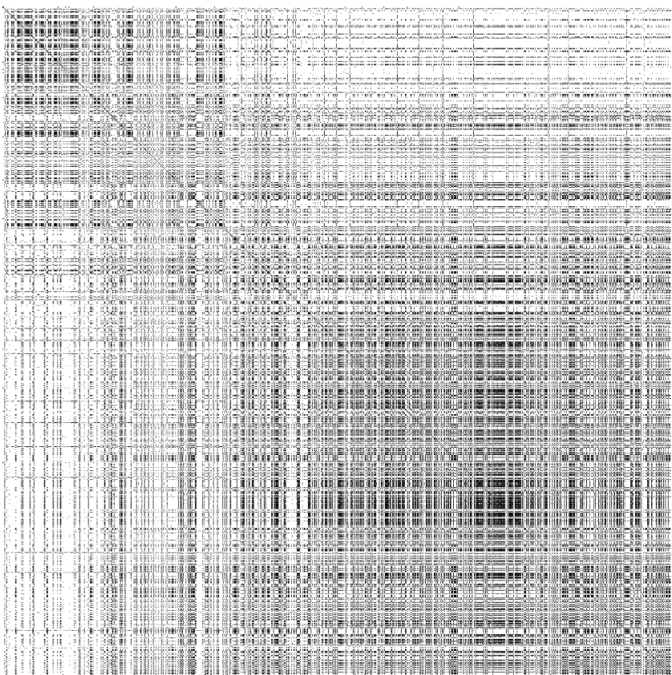

# CONCEPT

# Demo

[See demo here](http://134.209.9.142:3000/)

## DESCRIPTION

This application will show live charts about tweet sentiment based on Game of Thrones characters DURING the airtime of the show. The avarage sentiment over an hourly basis will be plotted on a chart. And the chart will change based on the user preference. 

## API

I will use the livestreaming API from twitter.
	-oAuth2 Authorisation(Using twitter-stream-api)
	-Filtering on #GOT on the "statuses/filter" endpoint
	-Ratelimit: Unclear for the streaming endpoint (found 60 tweets per second)

### Filters
I'm only fetching tweets that are in english and on the hashtag #got. I'm also filtering out retweets and quotes to prevent tweet duplications. The filter only cares about actual tweets made by users.

## Sentiment analysis
I'm using an npm package for the sentiment analysis of the tweets. It gives the tweet a score from 10 to -10. Where 10 is very positive and -10 is very bad. This is done by the AFINN sentiment lexicon. [Read more about AFINN](https://medium.com/@himanshu_23732/sentiment-analysis-with-afinn-lexicon-930533dfe75b).

## Alternate concept

### Description
I also had the idea to create a smilarity matrix about characters mentions during airtime to analyze which characters have the most mentions during a given time. This is done with the Cosine Similarity algorithm. But a similarity matrix is very abstract for users to be understood since its a very scientific data visualisation.

### On github

[Check the code on Github](https://github.com/Zekkie/cos-similarity)

#### Random time of the week

#### During airtime

### Cosine similarity
Cosine similarity calculates the the similarity of text by comparing the Cosine of two vectors.
[More here about cosine similarity](https://www.machinelearningplus.com/nlp/cosine-similarity/);

## Data Lifecycle

## Sketch

## D3JS

D3JS will generate charts for the data. 

## TODO

	- find an interesting user interaction with the application
	- create the server..