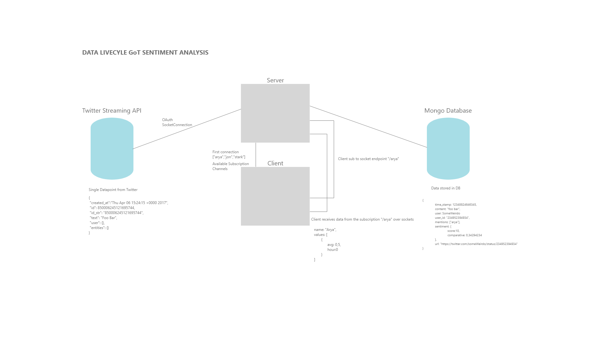

# CONCEPT

## DESCRIPTION

This application will show live charts about tweet sentiment based on Game of Thrones characters. Where users can subscribe to a character and fetch live data about that chatracter. This will be plotted onto a chart.

## API

I will use the livestreaming API from twitter.
	-oAuth2 Authorisation(Using twitter-stream-api)
	-Filtering on #GOT on the "statuses/filter" endpoint
	-Ratelimit: Unclear for the streaming endpoint (found 60 tweets per second)

## Data Lifecycle

## Sketch

## D3JS

D3JS will generate charts for the data. 

## TODO

	- find an interesting user interaction with the application
	- create the server..